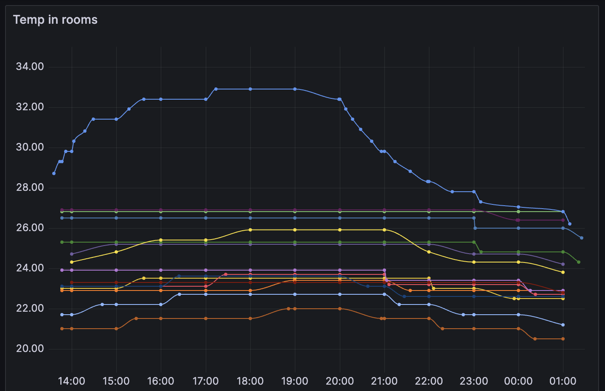

# SprutHub Metrics

Скрипты для сбора метрик с датчиков умного дома (SprutHub) и отправки в time-series базы данных для визуализации в Grafana.



## Возможности

- Сбор данных с температурных, влажностных, CO2 датчиков
- Мониторинг потребления энергии (ваттметры, амперметры, вольтметры)
- Отправка метрик в InfluxDB и VictoriaMetrics
- Отчёты в Telegram

## Быстрый старт

```bash
# Запуск баз данных
cd docker/influxDB && docker compose up -d
cd docker/victoriaMetrics && docker compose up -d
cd docker/grafana && docker compose up -d
```

Подробное руководство: [docs/start.md](docs/start.md)

## Почему две базы данных?

| База | Назначение | Retention |
|------|------------|-----------|
| InfluxDB | Точные данные за короткий период | ~1 месяц |
| VictoriaMetrics | Долгосрочное хранение | 5 лет |

## Способы сбора метрик

- **Trigger** — при каждом изменении датчика
- **Cron** — периодически, для почасовых отчётов в Grafana
